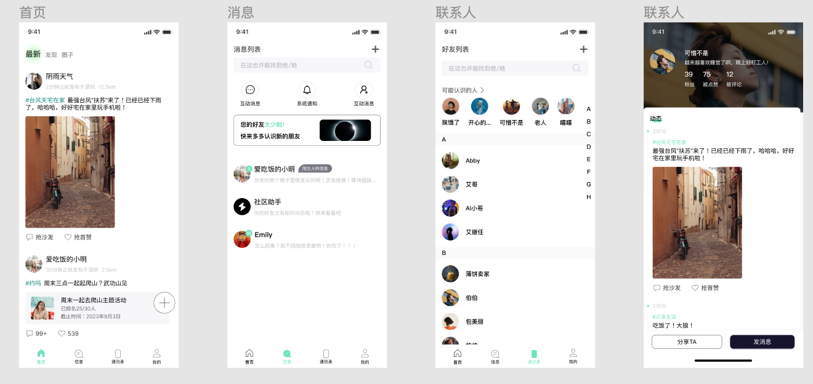

  

<h1 align="center"/>CIC <em>beta</em></h1>

An MVP version of community mini program.

 

  
  
    
    </a>
    

 

  

# 缤纷互动圈
## 简介
缤纷互动圈 - 一个MVP版本的社区小程序。

## 技术栈
- vue3
- nestjs
- 待补充...

## 其他，待补充...